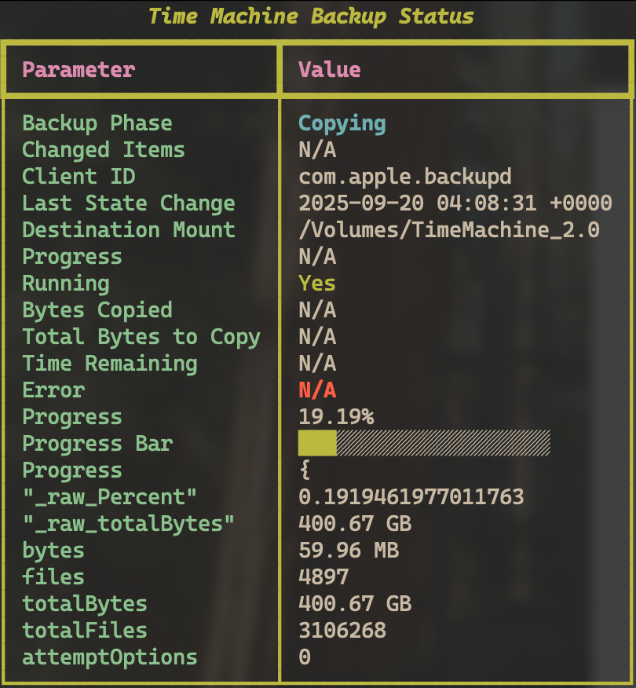

# timemachine-monitor
Apple Time-Machine Terminal GUI monitor

## Example

Below is an example screenshot of the application:



## Build & Run Instructions

- Create a virtual environment:
    ```bash
    python -m pip install virtualenv
    python -m virtualenv venv
    ```

- Activate the virtual environment:
  - Linux/macOS:
    ```bash
    # On Linux/macOS
    source ./venv/bin/activate
    ```
  - Windows
    ```ps1
    # On Windows (PowerShell)
    .\venv\Scripts\Activate.ps1
    ```
- Install dependencies and run the application:
    ```bash
    pip install -r requirements.txt
    python tm_status.py
    ```
